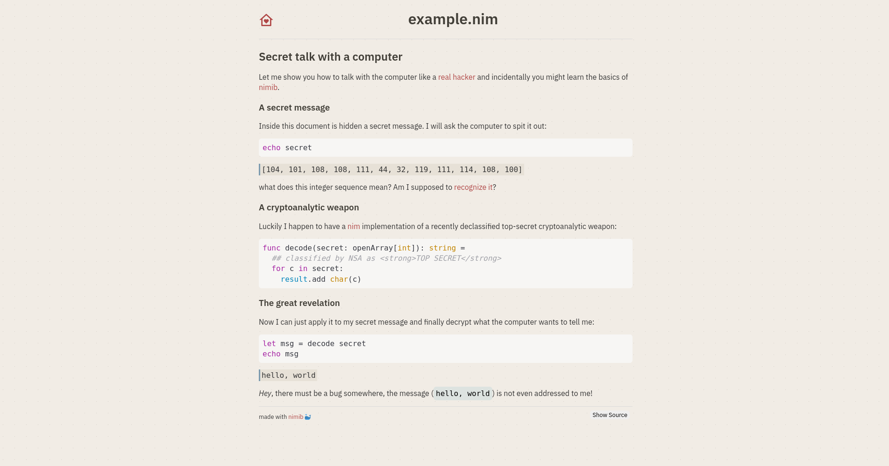

# Bujo for Nimib

A [Bujo](https://piotrsss.github.io/logseq-tools/public/#/bujo-themes) inspired theme for [Nimib](https://github.com/pietroppeter/nimib).

# Preview


# Usage

To use Nimibujo instead of the default stylesheet, add this line after your initial `nbInit` call:

```nim
nbDoc.context["stylesheet"] = """<link rel="stylesheet" href="style.css">"""
```

Improvements of path handling of Nimib is being worked on as we [speak](https://github.com/pietroppeter/nimib/issues/55)!

